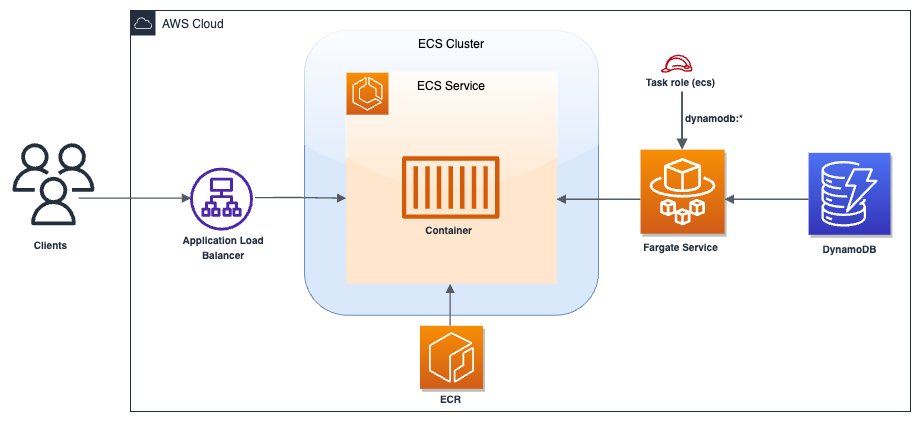

# Building an HTTP API with a private integration to an Amazon ECS service

## Prerequisites

1. Make sure to install `Node.js`.
2. Make sure `Docker` is up and running.
3. Install `cdk` toolkit.
   ```
   npm install -g aws-cdk
   ```
4. Configure AWS Credentials in 2 ways:

- Configure credentials via AWS CLI.
  ```
  aws configure
  ```
- Alternatively, configure credentials via Environment Variables - add the following variable in your `.zshrc` or .`bashrc` file and update the values.
  ```
  export AWS_ACCESS_KEY_ID=your_access_key
  export AWS_SECRET_ACCESS_KEY=your_secret_key
  export
  # Only if you are using temporary security credentials
  AWS_SESSION_TOKEN=your_session_token
  export AWS_REGION=your_region
  ```

## Running the project

1. To run this project, execute the following commands.
   ```
   - git clone https://github.com/naithagoni/aws-cdk-projects.git
   - cd aws-cdk-projects/apigw(http)-ecs(fargate)-dynamodb
   - npm i
   - cd aws-cdk-projects/apigw(http)-ecs(fargate)-dynamodb
   - npm i
   ```

## Application architecture diagram




  > - Before proceding, create a `templates` directory - ```mkdir templates```

## Bootstraping the stack

- After Building UI/REST APIs and Provisioning the UI/Backend As Code, before deploying the stack, make sure to issue `cdk bootstrap --output=./templates` command(**_Deploys the CDK toolkit stack into an AWS environment_**) so that CDK CLI will create the necessary CDK assets in AWS before the deployment.

## Synthesizing the stack (IaaS)

- You can synthesize the CDK app with `cdk synth --output=./templates` command(**_Synthesizes and prints the CloudFormation template for this stack_**). It will make sure the CDK code can be compiled to the CloudFormation template.

## Deploying the Infrastructure to AWS

- To provision the cloud resources and deploy the application code to AWS:
  ```
  cdk deploy --output=./templates
  ```

## Cleanup Infrastructure

- ```
  cdk destroy --output=./templates
  ```

## Steps to create a CDK project

1. Creating a new directory and change into that directory.
   ```
   mkdir <PROJECT_NAME>
   cd <PROJECT_NAME>
   ```
2. Initializing a cdk typescript project.
   ```
   cdk init app --language typescript
   ```
